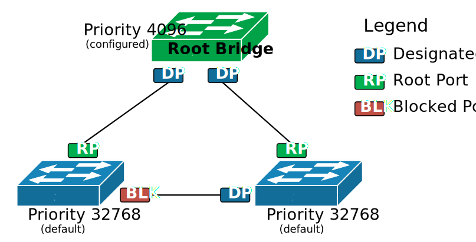

# stp - spanning tree protocol

### why we need it?
Ethernet does not work in redundant topologies because of Ethernet loops also called layer-2 loops or broadcast storms.

#### Problem 1 - Even one looping frame causes a broadcast storm.

#### Problem 2 - The storm causes another problem called MAC table instability.
 - If we recall the MAC learning process, when a switch receives a frame, it creates an entry in the MAC address table for the source address and the incoming port. But in case of a broadcast storm, multiple copies of the same frame loop around and the switch receives it on multiple interfaces. But a single MAC address can be tied to one interface only. Therefore the switch is constantly rewriting the entry for the source MAC address with a different interface and hence the instability. 

#### Problem 3 - End devices receive multiple copies of the same frame.

## what spanning tree does?
When Spanning-Tree is enabled on a switch (it is by default on all Cisco switches), it controls the state of every switch port and places each one in either a forwarding or a blocking state where:

    - Ports in forwarding state send and receive frames and act as normal switch interface. In our examples, these ports are shown in green.
    - Ports in blocking state do not process any frames except for Spanning-Tree messages and do not learn MAC addresses. In the examples, these ports are shown in orange.

## how it works?

#### root bridge selection
- Switches elect a Root Bridge based on a value called Bridge ID. The switch that has the lowest BID value is elected the Root Bridge of the topology. BID is not a single value, but it is composed of two different value types.

    - BID = (Priority + VLAN number) : (System MAC address)

#### Detecting Loops

- Once the Root election is completed, the switches start identifying loops. A switch understands that there is a loop when it receives BPDUs from the Root-Bridge on more than one interface.  

- A key to correctly understand how this works is to understand what Superior BPDU is. A Superior BPDU has one of the following properties in that order:

    Lower cost to the Root Bridge.
    Lower neighbor bridge ID.
    Lower neighbor port priority.
    Lower neighbor internal port number.

#### Setting up the port roles

| Port Role       | Description                                                                                                                                                           |
|-----------------|-----------------------------------------------------------------------------------------------------------------------------------------------------------------------|
| **Root Port**   | Represents the best path towards the Root Bridge. The switch receives BPDUs with the lowest cost to the root on this port. Does not send BPDUs via this port. Switch learns MAC addresses on this port. |
| **Designated Port** | A port that points away from the root (downstream port). BPDUs are sent out this port. Switch learns MAC addresses on this port.                                   |
| **Blocked Port** | The switch does not learn MAC addresses on this port. The port does not forward any Ethernet traffic.                                                               |
